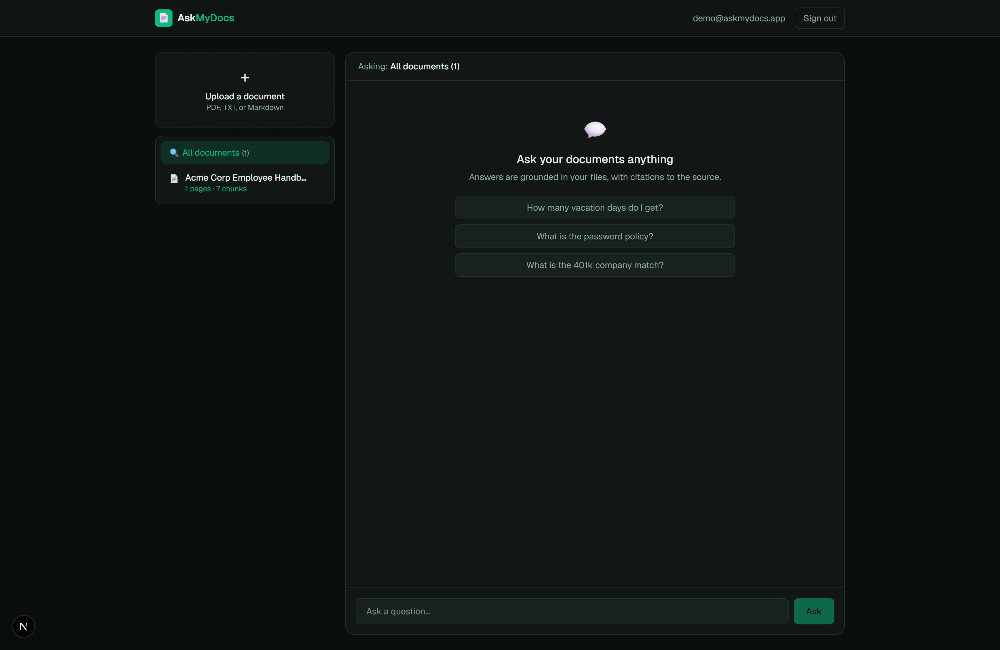
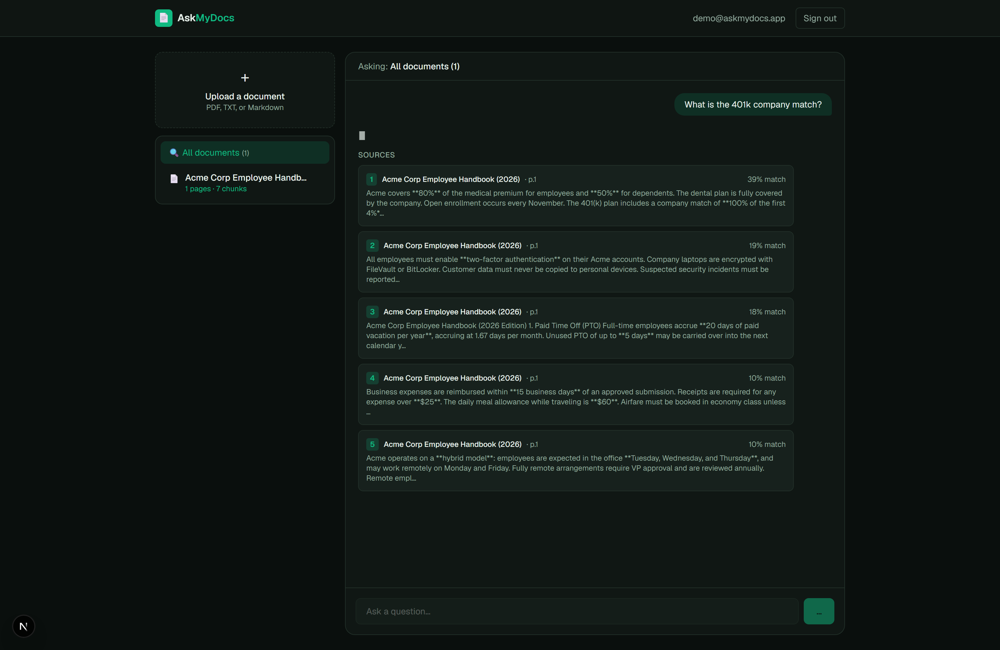

<div align="center">

# 📄 AskMyDocs

### Chat With Your Documents — RAG Q&A With Citations

*Upload your PDFs, Office files (Word, Excel, PowerPoint), or plain text, ask a question in plain English, and get an answer grounded **only** in your files — with a citation to the exact source passage, page, row or slide for every claim. Scanned/image PDFs are read with OCR.*

<br/>

[](https://nextjs.org/)
[](https://react.dev/)
[](https://www.typescriptlang.org/)
[](https://tailwindcss.com/)
[](https://www.postgresql.org/)
[](https://www.prisma.io/)
[](https://huggingface.co/docs/transformers.js)
[](https://www.anthropic.com/)

[](LICENSE)


</div>

---

## 📖 Overview

**The problem:** teams waste hours hunting through PDFs, manuals and contracts to
find one answer — and when an AI chatbot answers, you can't tell whether it made
the answer up.

**The solution:** **AskMyDocs** is a full **Retrieval-Augmented Generation (RAG)**
application. Upload documents, ask questions in plain English, and get answers
grounded **only in your files** — each with a **citation to the exact source
passage, page, and a match score**, so you can trust and verify every claim.

What makes it interesting is a deliberately **two-stage AI pipeline**:

- 🧠 **Embeddings run locally** — chunks are embedded on-device with
  `all-MiniLM-L6-v2` via transformers.js. **No embedding API, no per-call cost,
  works offline, and no document text leaves the box.**
- ✍️ **Generation runs remotely** — Claude (or Gemini) writes the answer *grounded*
  in the retrieved sources, with a **fully-offline extractive fallback** so the
  RAG pipeline is demonstrable end-to-end even with **no API key**.

> **The one-liner:** a Next.js 16 App-Router app that parses documents page-by-page,
> splits them into structure-aware chunks, embeds them locally into 384-dim vectors,
> ranks them by cosine similarity, and streams a Claude-written answer with inline
> `[n]` citations back to the exact source.

<div align="center">

**🔑 Demo login** &nbsp;·&nbsp; `demo@askmydocs.app` &nbsp;/&nbsp; `demo1234`
&nbsp;·&nbsp; *(a sample employee handbook is pre-loaded — try "What is the 401k company match?")*

</div>

---

## 📸 Screenshots

### The workspace — *your document library, scope selector & suggested questions*
> Upload PDF, Word, Excel, PowerPoint, CSV or text on the left, choose to ask across all documents or just one, and start with a suggested question.

<div align="center">
  
</div>

### Grounded answer with citations — *the headline*
> Every question resolves to a ranked **SOURCES** panel — the top-5 chunks, each with document, page and a **% match** — and the grounded answer streams above it with inline `[n]` badges you can trace back to the source.

<div align="center">
  
</div>

---

## ✨ Features

| Area | What it does |
|------|--------------|
| 🔐 **Auth** | Email/password (bcrypt) via next-auth with JWT sessions. Every document & query is scoped to the signed-in user. |
| 📤 **Multi-format ingest** | PDF, Word (`.docx`), Excel (`.xlsx`/`.xls`), PowerPoint (`.pptx`), CSV, TXT & Markdown. Files are parsed into citable units, chunked, embedded and indexed — with live `PROCESSING → READY` status. |
| 🔍 **OCR fallback** | Scanned / image-only PDFs (no text layer) are transcribed with **Gemini-vision OCR**, so they become fully searchable with page citations. |
| 🧠 **Ask** | Questions are answered **only** from your documents and streamed token-by-token. |
| 🔗 **Citations** | Every answer cites its sources: document + location (page / row / slide) + a **match score** + a snippet, with inline `[n]` badges. |
| 🗂️ **Scope** | Ask across **all** your documents or narrow to a **single** one. |
| 💸 **Zero-cost core** | Local embeddings + an extractive fallback mean the full RAG loop works offline, free, with no API key. |

---

## 🧠 How the RAG pipeline works *(the interesting part)*

### Ingestion — `src/lib/ingest.ts`
1. **Parse** (`parse.ts`) — a router by file type that normalizes every format to the same per-location shape: PDFs **page-by-page** (`pdf-parse` v2) with a **Gemini-vision OCR fallback** for image-only PDFs; Word via `mammoth`; Excel/CSV via SheetJS (**one unit per row**); PowerPoint (**one unit per slide**); TXT/MD directly — so a citation always points at a real page, row or slide.
2. **Chunk** (`chunk.ts`) — text is split along its **structure** (markdown headings, paragraphs) into ~450-char, topically-coherent chunks.
   > *This matters: fixed-size windows straddle topics and wreck retrieval precision — structure-aware chunks fixed it.*
3. **Embed** (`embeddings.ts`) — each chunk is embedded **locally** with `all-MiniLM-L6-v2` via transformers.js → a **384-dim** vector.
4. **Store** — vectors are saved as JSON alongside each chunk in PostgreSQL — **zero extra infra**.

### Query — `src/lib/retrieve.ts` → `src/app/api/ask/route.ts`
1. Embed the question, score every candidate chunk by **cosine similarity**, take the **top 5**.
2. Build a numbered-source prompt and ask Claude to answer **grounded in those sources**, citing `[n]`.
3. **Stream** the response as `citations JSON` + a delimiter + the answer text, so the UI renders sources instantly, then streams the answer.
4. **No API key?** It falls back to returning the retrieved passages — retrieval stays demonstrable end-to-end for free.

> At this scale, in-memory cosine ranking is simple and fully explainable. To scale, you'd push vectors into an ANN index or PostgreSQL's `pgvector`.

> 📐 The full ingest-to-answer walkthrough lives in **[`docs/ARCHITECTURE.md`](docs/ARCHITECTURE.md)**.

---

## 🛠️ Tech Stack

| Layer | Technology |
|-------|-----------|
| **Framework** | Next.js 16 (App Router, streaming responses) |
| **UI** | React 19 · Tailwind CSS 4 |
| **Language** | TypeScript 5 |
| **Database** | PostgreSQL |
| **ORM** | Prisma 6 |
| **Auth** | next-auth (credentials, JWT) + bcryptjs |
| **Embeddings** | transformers.js — `all-MiniLM-L6-v2` (local, 384-dim) |
| **Parsing** | pdf-parse v2 (per-page) · mammoth (Word) · xlsx/SheetJS (Excel/CSV) · jszip (PowerPoint) · Gemini-vision OCR (scanned PDFs) |
| **Answers** | Anthropic Claude (streaming) · Google Gemini (optional) · extractive fallback |

---

## 🚀 Getting Started

### Prerequisites
- **Node.js** 18.18+ (20+ recommended)
- **PostgreSQL** 14+ running locally (or a hosted connection string)

### Installation

```bash
# 1. Clone the repository
git clone https://github.com/bhanu87777/AskMyDocs-RAG-Document-QA.git
cd AskMyDocs-RAG-Document-QA

# 2. Install dependencies
npm install

# 3. Configure environment
cp .env.example .env
#   → set DATABASE_URL, generate AUTH_SECRET (openssl rand -base64 32),
#     and optionally add ANTHROPIC_API_KEY or GEMINI_API_KEY

# 4. Create the schema + seed a demo user and sample handbook
npx prisma db push       # syncs the PostgreSQL schema (the committed migration is MySQL-dialect)
npm run db:seed          # demo user + ingests a sample employee handbook

# 5. Run the dev server
npm run dev              # → http://localhost:3000
```

Then sign in with the demo account: **`demo@askmydocs.app` / `demo1234`**.

> ⏳ The first upload/seed downloads the ~25 MB embedding model **once**, then caches it locally.

---

## 📋 Usage

| Command | Description |
|---------|-------------|
| `npm run dev` | Start the development server |
| `npm run build` | Production build |
| `npm run start` | Serve the production build |
| `npm run lint` | Run ESLint |
| `npm run db:seed` | Seed a demo user and ingest the sample handbook |
| `npx prisma db push` | Create/sync the PostgreSQL schema |
| `npx prisma studio` | Browse the data in Prisma Studio |

---

## 📁 Project Structure

```
AskMyDocs-RAG-Document-QA/
├── assets/
│   └── screenshots/          # README imagery
├── docs/
│   ├── ARCHITECTURE.md       # ingest → answer walkthrough
│   ├── AskMyDocs_1_Features_Walkthrough.pdf
│   └── AskMyDocs_2_Codebase_Guide.pdf
├── prisma/
│   ├── schema.prisma         # User, Document, Chunk(embedding), Query
│   └── seed.ts               # demo user + ingests the sample handbook
├── src/
│   ├── app/
│   │   ├── api/              # ask, documents, register, auth
│   │   ├── chat/             # the workspace
│   │   ├── login/            # auth screen
│   │   ├── page.tsx          # landing (redirects to /chat if signed in)
│   │   └── layout.tsx
│   ├── components/           # Workspace · ChatPanel · DocumentLibrary · Navbar
│   └── lib/                  # the RAG pipeline
│       ├── ingest · parse · ocr · chunk  # multi-format ingestion (+ OCR fallback)
│       ├── embeddings · similarity        # local vectors + cosine ranking
│       ├── retrieve · answer              # top-5 retrieval + grounded generation
│       └── auth · session · prisma
├── .env.example
├── LICENSE
└── package.json
```

> `src/lib/` is the hub every part routes through — parsing, chunking, embedding,
> retrieval and generation all live here, kept out of the route handlers.

---

## 🔭 Future Improvements

- [ ] **Native vector search** — store vectors in PostgreSQL's `pgvector` column with an ANN index for scale
- [ ] **Inline PDF viewer** — highlight the exact cited sentence in the source document
- [ ] **Multi-turn conversations** — follow-up questions with conversation context
- [x] **More formats** — Word, Excel, PowerPoint & CSV ingestion, plus OCR for scanned PDFs ✅
- [ ] **Even more input** — HTML pages and pasted-text ingestion
- [ ] **Reranking** — a cross-encoder re-rank pass over the top-k for sharper answers
- [ ] **Team workspaces** — shared document libraries with role-based access
- [ ] **Test suite** — unit tests for `chunk.ts` / `similarity.ts` + integration tests on `/api/ask`

---

## 🤝 Contributing

Contributions, issues, and feature requests are welcome!

1. Fork the project
2. Create your feature branch (`git checkout -b feature/amazing-feature`)
3. Commit your changes (`git commit -m 'Add amazing feature'`)
4. Push to the branch (`git push origin feature/amazing-feature`)
5. Open a Pull Request

Please run `npm run lint` before submitting.

---

## 📄 License

Distributed under the **MIT License**. See [`LICENSE`](LICENSE) for details.

---

## 👤 Author

**Bhanu Prakash M**

[](https://github.com/bhanu87777)

> 💡 If AskMyDocs helped or impressed you, consider giving the repo a ⭐ — it genuinely helps!

<div align="center">
<sub>Built as a portfolio project to demonstrate a full RAG pipeline — parsing, chunking, local embeddings, vector retrieval, and grounded generation with citations — end-to-end.</sub>
</div>
